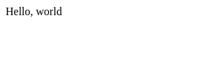
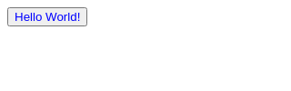
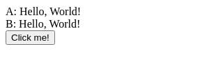
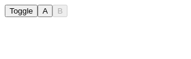
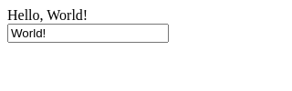
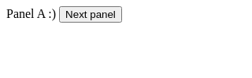

<h1 align="center">domdom</h1>
<p align="center">The proactive web front-end framework for the unprofessional</p>
<p align="center">

  <a href="https://npmjs.org/package/@eirikb/domdom">
    
  </a>
  <a href="https://github.com/eirikb/domdom/actions?query=workflow%3ABuild">
    
  </a>
  <a href="https://bundlephobia.com/result?p=@eirikb/domdom">
    
  </a>
</p>
<p align="center">
	<a href="https://www.npmjs.com/package/@eirikb/domdom">npm</a> ·
	<a href="https://deno.land/x/domdom">Deno</a>
</p>

---

**Facts** - not highlights, just facts:

- Alternative to React + Redux or Vue + Vuex
- Written in TypeScript
- No virtual dom
- Support for Deno (without jspm or pika)
- Nothing reactive - totally unreactive - fundamentally different from React
- One global observable state
    - Support for re-usable components (with partition of global state)
    - No local state
- TSX/JSX return pure elements
- Close to DOM


## Menu
  - [Deno](#deno)
  - [Getting started](#getting-started)
  - [Basics](#basics)
    - [Hello, world!](#hello,-world!)
    - [TSX tags are pure elements](#tsx-tags-are-pure-elements)
    - [Domponents](#domponents)
    - [Domponents with options](#domponents-with-options)
    - [Events](#events)
  - [State](#state)
    - [Listen for changes](#listen-for-changes)
    - [Listen for changes in arrays / objects](#listen-for-changes-in-arrays--objects)
    - [Listen for changes in sub-listeners](#listen-for-changes-in-sub-listeners)
    - [Update state](#update-state)
    - [Data in attributes](#data-in-attributes)
    - [Automatic binding](#automatic-binding)
  - [Pathifier](#pathifier)
  - [Recipies](#recipies)
    - [Routing](#routing)
    - [Structure](#structure)
    - [Animation (garbage collection)](#animation-(garbage-collection))


## Deno

domdom has full support for Deno!  
See https://github.com/eirikb/domdom-deno and https://deno.land/x/domdom .


## Getting started

Install:
```bash
npm i @eirikb/domdom
```

## Basics

### Hello, world!
run.sh:
```bash
npx parcel index.html
```
[index.html](./examples/hello-world/index.html):
```html
<body>
<script src="app.tsx"></script>
</body>
```
[app.tsx](./examples/hello-world/app.tsx):
```tsx
import domdom from '@eirikb/domdom';

interface Data {
  hello: string;
}

const { React, init, don, pathOf } = domdom<Data>({ hello: 'world' });

const view = <div>Hello, {don(pathOf().hello)}</div>;

init(document.body, view);
```

Output:



### TSX tags are pure elements

All elements created with tsx are elements which can be instantly referenced.

[app.tsx](./examples/pure-elements/app.tsx):
```tsx
const element = <span>Hello, world :)</span>;
element.style.color = 'red';
```
Output:


### Domponents

By creating a function you create a Domponent (component).

[app.tsx](./examples/domponents/app.tsx):
```tsx
const Button = () => <button>I am button!</button>;

const view = (
  <div>
    <Button />
  </div>
);
```
Output:


### Domponents with options

It's possible to pass in children, and get a callback when a domponent is mounted (in DOM).  
All attributes are passed in first argument.

[app.tsx](./examples/domponents-options/app.tsx):
```tsx
const Button = ({ color }: { color: string }, { mounted, children }: Opts) => {
  const button = <button>Hello {children}</button>;
  mounted(() => (button.style.color = color));
  return button;
};

const view = (
  <div>
    <Button color="blue">World!</Button>
  </div>
);
```
Output:



### Events

All attributes starting with 'on' are added to addEventListener on the element.

[app.tsx](./examples/events/app.tsx):
```tsx
const view = (
  <button
    onClick={(event: Event) => {
      event.target.style.color = 'red';
    }}
  >
    Click me!
  </button>
);
```
Output:


## State

State handling in domdom is simple: No local state, only one huge global state.  
Setting data directly on the `data` object can update DOM directly in combination with `don`

### Listen for changes

[app.tsx](./examples/don/app.tsx):
```tsx
interface Data {
  hello: string;
}

const { React, init, don, pathOf } = domdom<Data>({
  hello: 'World!',
});

const view = <span>{don(pathOf().hello)}</span>;
```
Output:


### Listen for changes in arrays / objects

[app.tsx](./examples/don-wildcard/app.tsx):
```tsx
interface User {
  name: string;
}

interface Data {
  users: User[];
}

const { React, init, don, pathOf } = domdom<Data>({
  users: [{ name: 'Hello' }, { name: 'World' }],
});

const view = (
  <ul>
    {don(pathOf().users.$).map(user => (
      <li>{user.name}</li>
    ))}
  </ul>
);
```
Output:


### Listen for changes in sub-listeners

[app.tsx](./examples/don-children/app.tsx):
```tsx
interface User {
  name: string;
}

interface Data {
  users: User[];
}

const { React, init, don, data, pathOf } = domdom<Data>({
  users: [{ name: 'Hello' }, { name: 'World' }, { name: 'Yup' }],
});

const view = (
  <div>
    <ul>
      {don(pathOf().users.$).map(user => (
        <li>{don(pathOf(user).name)}</li>
      ))}
    </ul>
    <button onClick={() => (data.users[1].name = '🤷')}>Click me!</button>
  </div>
);
```
Output:


### Update state

[app.tsx](./examples/data-set/app.tsx):
```tsx
interface Data {
  hello: string;
}

const { React, init, don, pathOf, data } = domdom<Data>({
  hello: 'World!',
});

const view = (
  <div>
    <div>A: Hello, {data.hello}</div>
    <div>B: Hello, {don(pathOf().hello)}</div>
    <div>
      <button onClick={() => (data.hello = 'there!')}>Click me!</button>
    </div>
  </div>
);
```
Output:



### Data in attributes

[app.tsx](./examples/data-attributes/app.tsx):
```tsx
interface Data {
  toggle: boolean;
}

const { React, init, don, pathOf, data } = domdom<Data>({
  toggle: false,
});

const view = (
  <div>
    <button onClick={() => (data.toggle = !data.toggle)}>Toggle</button>
    <button disabled={don(pathOf().toggle)}>A</button>
    <button disabled={don(pathOf().toggle).map(res => !res)}>B</button>
  </div>
);
```
Output:



### Automatic binding

[app.tsx](./examples/dd-model/app.tsx):
```tsx
interface Data {
  hello: string;
}

const { React, init, don, pathOf } = domdom<Data>({
  hello: 'World!',
});

const view = (
  <div>
    <div>Hello, {don(pathOf().hello)}</div>
    <div>
      <input type="text" dd-model="hello" />
    </div>
  </div>
);
```
Output:



## Pathifier

Aggregate data.
Supports:
  * `map`
  * `sort`
  * `slice`
  * `filter`

And in addition accompanying "on" version, making it possible to listen for an external path:
  * `mapOn`
  * `sortOn`
  * `sliceOn`
  * `filterOn`

[app.tsx](./examples/pathifier/app.tsx):
```tsx
interface User {
  name: string;
}

interface Data {
  users: User[];
}

const { React, init, don, pathOf } = domdom<Data>({
  users: [{ name: 'Yup' }, { name: 'World' }, { name: 'Hello' }],
});

const view = (
  <ul>
    {don(pathOf().users.$)
      .filter(user => user.name !== 'World')
      .sort((a, b) => a.name.localeCompare(b.name))
      .map(user => (
        <li>{user.name}</li>
      ))}
  </ul>
);
```
Output:


## Recipies

How to handle common tasks with domdom

### Routing

[app.tsx](./examples/routing/app.tsx):
```tsx
import domdom from '@eirikb/domdom';

type Route = 'panel-a' | 'panel-b';

interface Data {
  route: Route;
}

const { React, init, don, pathOf, data } = domdom<Data>({ route: 'panel-a' });

const PanelA = () => (
  <div>
    Panel A :) <button onclick={() => gotoRoute('panel-b')}>Next panel</button>
  </div>
);

const PanelB = () => <div>Panel B! (hash is: {window.location.hash})</div>;

const view = (
  <div>
    {don(pathOf().route).map((route: Route) => {
      switch (route) {
        case 'panel-b':
          return <PanelB />;

        default:
          return <PanelA />;
      }
    })}
  </div>
);

function gotoRoute(route: Route) {
  window.location.hash = route;
}

window.addEventListener(
  'hashchange',
  () => (data.route = window.location.hash.slice(1) as Route)
);

init(document.body, view);
```
Output:



### Structure

This is how I would suggest putting domdom in its own file for importing.

[app.tsx](./examples/structure/app.tsx):
```tsx
import { data, don, init, pathOf, React } from './domdom';

const view = <div>Hello, {don(pathOf().hello)}</div>;

data.hello = 'There :)';

init(document.body, view);
```
[domdom.ts](./examples/structure/domdom.ts):
```ts
import domdom from '@eirikb/domdom';

export interface Data {
  hello: string;
}

const dd = domdom<Data>({ hello: 'world' });
export const React = dd.React;
export const init = dd.init;
export const data = dd.data;
export const don = dd.don;
export const pathOf = dd.pathOf;
```
Output:


### Animation (garbage collection)

At writing moment domdom doesn't have any unmount callback.
I'm not a big fan of destructors, unmounted, dispose or similar.
This might seem silly, and it might not be obvious how to use say setInterval, without this preventing the element from ever being cleaned up by garbage collector.

This is how I would suggest putting domdom in its own file for importing.

[app.tsx](./examples/ticks/app.tsx):
```tsx
import domdom from '@eirikb/domdom';

interface Data {
  run: boolean;
  tick: number;
}

const { React, init, don, pathOf, data } = domdom<Data>({
  run: false,
  tick: 0,
});

const view = (
  <div>
     ({ rotate: `${tick % 180}deg` }))}
    />
    <button onClick={() => (data.run = !data.run)}>Start/Stop</button>
  </div>
);

(function loop(time) {
  if (data.run) {
    data.tick = time;
  }
  requestAnimationFrame(loop);
})(0);

init(document.body, view);
```

  