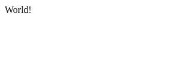
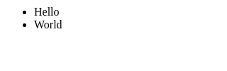

<h1 align="center">domdom</h1>
<p align="center">The proactive web front-end framework for the unprofessional</p>
<p align="center">

  <a href="https://npmjs.org/package/@eirikb/domdom">
    
  </a>
  <a href="https://github.com/eirikb/domdom/actions?query=workflow%3ABuild">
    
  </a>
  <a href="https://bundlephobia.com/result?p=@eirikb/domdom">
    
  </a>
</p>
<p align="center">
	<a href="https://www.npmjs.com/package/@eirikb/domdom">npm</a> ·
	<a href="https://deno.land/x/domdom">Deno</a>
</p>

---

**Facts** - not highlights, just facts:

- Alternative to React + Redux or Vue + Vuex
- Written in TypeScript
- No virtual dom
- Support for Deno (without jspm or pika)
- Nothing reactive - totally unreactive - fundamentally different from React
- One global observable state
    - Support for re-usable components (with partition of global state)
    - No local state
- TSX/JSX return pure elements


## Menu
  - [Deno](#deno)
  - [Getting started](#getting-started)
  - [Basics](#basics)
    - [Hello, world!](#hello,-world!)
    - [TSX tags are pure elements](#tsx-tags-are-pure-elements)
    - [Domponents](#domponents)
    - [Domponents with options](#domponents-with-options)
    - [Events](#events)
  - [State](#state)
    - [Listen for changes](#listen-for-changes)
    - [Listen for changes in arrays / objects](#listen-for-changes-in-arrays--objects)
    - [Listen for changes in sub-listeners](#listen-for-changes-in-sub-listeners)
    - [Update state](#update-state)
    - [Data in attributes](#data-in-attributes)
    - [Automatic binding](#automatic-binding)
  - [Pathifier](#pathifier)


## Deno

domdom has full support for Deno!  
See https://github.com/eirikb/domdom-deno and https://deno.land/x/domdom .


## Getting started

Install:
```bash
npm i @eirikb/domdom
```

## Basics

### Hello, world!
run.sh:
```bash
npx parcel index.html
```
[index.html](../examples/hello-world/index.html):
```html

```
[app.tsx](../examples/hello-world/app.tsx):
```tsx

```

Output:


### TSX tags are pure elements

All elements created with tsx are elements which can be instantly referenced.

[app.tsx](../examples/pure-elements/app.tsx):
```tsx

```
Output:


### Domponents

By creating a function you create a Domponent (component).

[app.tsx](../examples/domponents/app.tsx):
```tsx

```
Output:


### Domponents with options

It's possible to pass in children, and get a callback when a domponent is mounted (in DOM).  
All attributes are passed in first argument.

[app.tsx](../examples/domponents-options/app.tsx):
```tsx

```
Output:


### Events

All attributes starting with 'on' are added to addEventListener on the element.

[app.tsx](../examples/events/app.tsx):
```tsx

```
Output:


## State

State handling in domdom is simple: No local state, only one huge global state.  
Setting data directly on the `data` object can update DOM directly in combination with `don`

### Listen for changes

[app.tsx](../examples/don/app.tsx):
```tsx

```
Output:



### Listen for changes in arrays / objects

[app.tsx](../examples/don-wildcard/app.tsx):
```tsx

```
Output:



### Listen for changes in sub-listeners

[app.tsx](../examples/don-children/app.tsx):
```tsx

```
Output:


### Update state

[app.tsx](../examples/data-set/app.tsx):
```tsx

```
Output:


### Data in attributes

[app.tsx](../examples/data-attributes/app.tsx):
```tsx

```
Output:


### Automatic binding

[app.tsx](../examples/dd-model/app.tsx):
```tsx

```
Output:


## Pathifier

Aggregate data.
Supports:
  * `map`
  * `sort`
  * `slice`
  * `filter`

And in addition accompanying "on" version, making it possible to listen for an external path:
  * `mapOn`
  * `sortOn`
  * `sliceOn`
  * `filterOn`

[app.tsx](../examples/pathifier/app.tsx):
```tsx

```
Output:


  