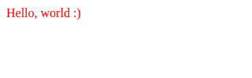
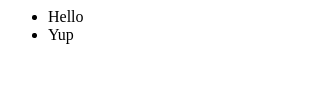

<h1 align="center">domdom</h1>
<p align="center">The proactive web front-end framework for the unprofessional</p>
<p align="center">

  <a href="https://npmjs.org/package/@eirikb/domdom">
    
  </a>
  <a href="https://github.com/eirikb/domdom/actions?query=workflow%3ABuild">
    
  </a>
  <a href="https://bundlephobia.com/result?p=@eirikb/domdom">
    
  </a>
</p>
<p align="center">
	<a href="https://www.npmjs.com/package/@eirikb/domdom">npm</a> ·
	<a href="https://deno.land/x/domdom">Deno</a>
</p>

---

**Facts** - not highlights, just facts:

- Alternative to React + Redux or Vue + Vuex
- Written in TypeScript
- No virtual dom
- Support for Deno (without jspm or pika)
- Nothing reactive - totally unreactive - fundamentally different from React
- One global observable state
    - Support for re-usable components (with partition of global state)
    - No local state
- TSX/JSX return pure elements


## Menu
  - [Deno](#deno)
  - [Getting started](#getting-started)
  - [Basics](#basics)
    - [Hello, world!](#hello,-world!)
    - [TSX tags are pure elements](#tsx-tags-are-pure-elements)
    - [Domponents](#domponents)
    - [Domponents with options](#domponents-with-options)
    - [Events](#events)
  - [State](#state)
    - [Listen for changes](#listen-for-changes)
    - [Listen for changes in arrays / objects](#listen-for-changes-in-arrays--objects)
    - [Listen for changes in sub-listeners](#listen-for-changes-in-sub-listeners)
    - [Update state](#update-state)
    - [Automatic binding](#automatic-binding)
    - [Data in attributes](#data-in-attributes)
  - [Pathifier](#pathifier)


## Deno

domdom has full support for Deno!  
See https://github.com/eirikb/domdom-deno and https://deno.land/x/domdom .


## Getting started

Install:
```bash
npm i @eirikb/domdom
```

## Basics

### Hello, world!
run.sh:
```bash
npx parcel index.html
```
index.html:
```html
<body>
<script src="app.tsx"></script>
</body>
```
app.tsx:
```tsx
import domdom from '@eirikb/domdom';

interface Data {
  hello: string;
}

const { React, init, don, pathOf } = domdom<Data>({ hello: 'world' });

const view = <div>Hello, {don(pathOf().hello)}</div>;

init(document.body, view);
```

Output:


### TSX tags are pure elements

app.tsx:
```tsx
const element = <span>Hello, world :)</span>;
element.style.color = 'red';
```
Output:



### Domponents

app.tsx:
```tsx
const Button = () => <button>I am button!</button>;

const view = (
  <div>
    <Button />
  </div>
);
```
Output:


### Domponents with options

app.tsx:
```tsx
const Button = ({ color }: { color: string }, { mounted, children }: Opts) => {
  const button = <button>Hello {children}</button>;
  mounted(() => (button.style.color = color));
  return button;
};

const view = (
  <div>
    <Button color="blue">World!</Button>
  </div>
);
```
Output:


### Events

app.tsx:
```tsx
const view = (
  <button
    onClick={(event: Event) => {
      event.target.style.color = 'red';
    }}
  >
    Click me!
  </button>
);
```
Output:


## State

### Listen for changes

app.tsx:
```tsx
interface Data {
  hello: string;
}

const { React, init, don, pathOf } = domdom<Data>({
  hello: 'World!',
});

const view = <span>{don(pathOf().hello)}</span>;
```
Output:


### Listen for changes in arrays / objects

app.tsx:
```tsx
interface User {
  name: string;
}

interface Data {
  users: User[];
}

const { React, init, don, pathOf } = domdom<Data>({
  users: [{ name: 'Hello' }, { name: 'World' }],
});

const view = (
  <ul>
    {don(pathOf().users.$).map(user => (
      <li>{user.name}</li>
    ))}
  </ul>
);
```
Output:


### Listen for changes in sub-listeners

app.tsx:
```tsx
interface User {
  name: string;
}

interface Data {
  users: User[];
}

const { React, init, don, data, pathOf } = domdom<Data>({
  users: [{ name: 'Hello' }, { name: 'World' }, { name: 'Yup' }],
});

const view = (
  <div>
    <ul>
      {don(pathOf().users.$).map(user => (
        <li>{don(pathOf(user).name)}</li>
      ))}
    </ul>
    <button onClick={() => (data.users[1].name = '🤷')}>Click me!</button>
  </div>
);
```
Output:


### Update state

app.tsx:
```tsx
interface Data {
  hello: string;
}

const { React, init, don, pathOf, data } = domdom<Data>({
  hello: 'World!',
});

const view = (
  <div>
    <div>A: Hello, {data.hello}</div>
    <div>B: Hello, {don(pathOf().hello)}</div>
    <div>
      <button onClick={() => (data.hello = 'there!')}>Click me!</button>
    </div>
  </div>
);
```
Output:


### Automatic binding

app.tsx:
```tsx
interface Data {
  hello: string;
}

const { React, init, don, pathOf } = domdom<Data>({
  hello: 'World!',
});

const view = (
  <div>
    <div>Hello, {don(pathOf().hello)}</div>
    <div>
      <input type="text" dd-model="hello" />
    </div>
  </div>
);
```
Output:


### Data in attributes

app.tsx:
```tsx

```
Output:


## Pathifier

app.tsx:
```tsx
interface User {
  name: string;
}

interface Data {
  users: User[];
}

const { React, init, don, pathOf } = domdom<Data>({
  users: [{ name: 'Yup' }, { name: 'World' }, { name: 'Hello' }],
});

const view = (
  <ul>
    {don(pathOf().users.$)
      .filter(user => user.name !== 'World')
      .sort((a, b) => a.name.localeCompare(b.name))
      .map(user => (
        <li>{user.name}</li>
      ))}
  </ul>
);
```
Output:




  